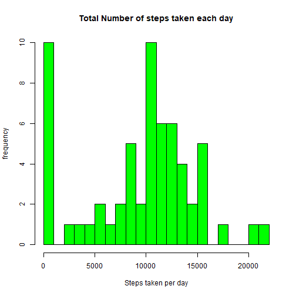
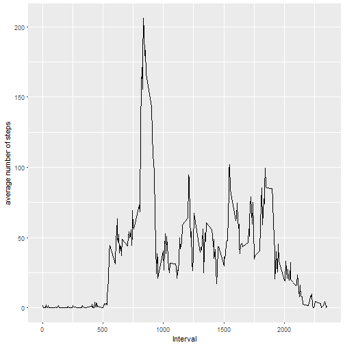
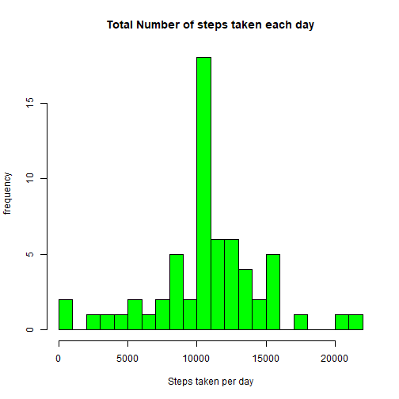
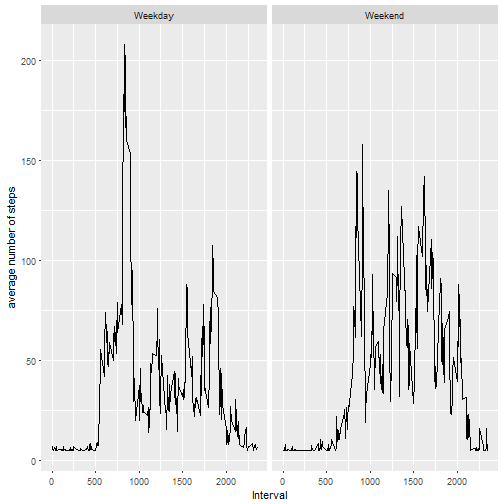

Reproducible Research: Course Project 1
=======================================

## Loading and preprocessing the data

1. Load the data


```r
activity <- read.csv("activity.csv")
```

2. Process/transform the data


```r
library(lubridate)
```

```
## 
## Attaching package: 'lubridate'
```

```
## The following object is masked from 'package:base':
## 
##     date
```

```r
activity$date <- ymd(activity$date)
```


## What is mean total number of steps taken per day?

1. Calculate the total number of steps taken per day


```r
stepsEachDay <- tapply(activity$steps, activity$date, sum , na.rm = TRUE)
```

2. Make a histogram of the total number of steps taken each day


```r
hist(stepsEachDay, xlab = "Steps taken per day", ylab = "frequency", col = "green", breaks = 25, main = "Total Number of steps taken each day")
```



3. Mean and Median of the total number of steps taken per day


```r
mean(stepsEachDay)
```

```
## [1] 9354.23
```

```r
median(stepsEachDay)
```

```
## [1] 10395
```


## What is the average daily activity pattern?

1. time series plot of the 5-minute interval (x-axis) and the average number of steps taken, averaged across all days (y-axis)


```r
library(ggplot2)
library(dplyr)
```

```
## 
## Attaching package: 'dplyr'
```

```
## The following objects are masked from 'package:lubridate':
## 
##     intersect, setdiff, union
```

```
## The following objects are masked from 'package:stats':
## 
##     filter, lag
```

```
## The following objects are masked from 'package:base':
## 
##     intersect, setdiff, setequal, union
```

```r
activityInterval <- group_by(activity, interval)
AvgSteps <- summarise(activityInterval, average = mean(steps, na.rm = TRUE))

qplot(AvgSteps$interval,AvgSteps$average, geom = "line", xlab = "Interval", ylab = "average number of steps")
```



2. Which 5-minute interval contains the maximum number of steps?


```r
AvgSteps[which.max(AvgSteps$average),1]
```

```
## # A tibble: 1 x 1
##   interval
##      <int>
## 1      835
```


## Imputing missing values

1.  total number of missing values in the dataset


```r
NAValues <- nrow(activity[is.na(activity$steps),])
```

2. Create a new dataset that is equal to the original dataset but with the missing data filled in.


```r
library(Hmisc)
```

```
## Loading required package: lattice
```

```
## Loading required package: survival
```

```
## Loading required package: Formula
```

```
## 
## Attaching package: 'Hmisc'
```

```
## The following objects are masked from 'package:dplyr':
## 
##     src, summarize
```

```
## The following objects are masked from 'package:base':
## 
##     format.pval, units
```

```r
activityImputed <- activity
activityImputed$steps <- impute(activity$steps, fun=mean)
```

3. Histogram of the total number of steps taken each day after imputation


```r
stepsImputed <- tapply(activityImputed$steps, activityImputed$date, sum)
hist(stepsImputed, xlab = "Steps taken per day", ylab = "frequency", col = "green", breaks = 25, main = "Total Number of steps taken each day")
```



4. Mean and Median total number of steps taken per day after imputation


```r
mean(stepsImputed)
```

```
## [1] 10766.19
```

```r
median(stepsImputed)
```

```
## [1] 10766.19
```

It is obvious that final results were remarakabely changed after imputation

## Are there differences in activity patterns between weekdays and weekends?

1. Create a new factor variable in the dataset with two levels - "weekday" and "weekend"


```r
activityImputed <- mutate(activityImputed, day = factor(weekdays(activityImputed$date)))
activityImputed <- mutate(activityImputed, weekday = factor((day == "Saturday" | day == "Sunday" ), labels = c("Weekday", "Weekend")))
```


2. panel plot containing a time series plot of the 5-minute interval (x-axis) and the average number of steps taken, averaged across all weekday days or weekend days (y-axis)


```r
activityImputedInterval <- group_by(activityImputed, interval, weekday)
AvgImputedSteps <- summarise(activityImputedInterval, average = mean(steps))
qplot(interval,average, data = AvgImputedSteps, geom = "line", xlab = "Interval", ylab = "average number of steps", facets = .~ weekday)
```




